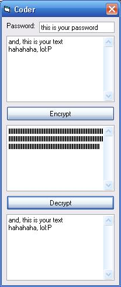



## super encrypter\!\!\! combined;\)

### Description

This code encrypts/decrypts a string. I saw to submissions on this site, combined them and made a few adjustments. so it's not 100% my idea.
 
### More Info
 
you need the text and the password (duh)

the code returns de encrypted/decrypted string

             |
---                |---
**Submitted On**   |2005-09-20 20:00:04
**By**             |[Compact](https://github.com/Planet-Source-Code/PSCIndex/blob/master/ByAuthor/compact.md)
**Level**          |Intermediate
**User Rating**    |4.0 (8 globes from 2 users)
**Compatibility**  |VB 5\.0, VB 6\.0
**Category**       |[Encryption](https://github.com/Planet-Source-Code/PSCIndex/blob/master/ByCategory/encryption__1-48.md)
**World**          |[Visual Basic](https://github.com/Planet-Source-Code/PSCIndex/blob/master/ByWorld/visual-basic.md)
**Archive File**   |[super\_encr1934069202005\.zip](https://github.com/Planet-Source-Code/compact-super-encrypter-combined__1-62631/archive/master.zip)

### API Declarations

just look at the zip

